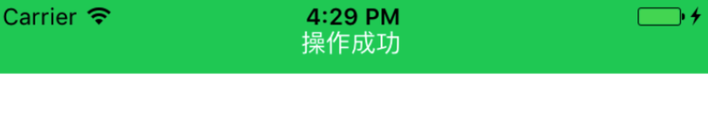
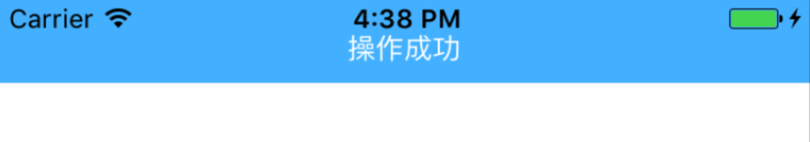
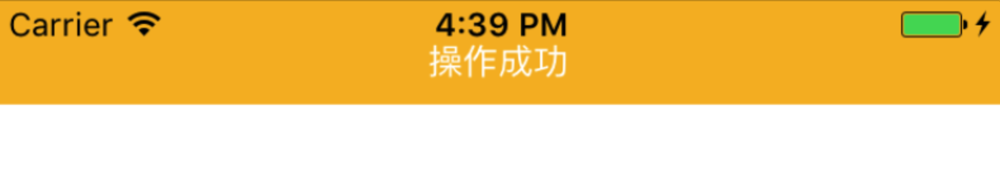
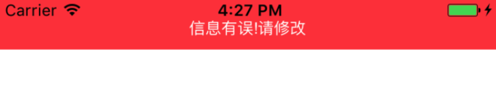

###ZLAlertView : 一个极度轻量的顶部提示框

#####使用方式：
    第一步: 将`ZLAlertView`引入到工程文件中。

    第二步: 代码如下    
    
      @IBAction func openAlertView1(_ sender: UIButton) {
            let alert =  ZLAlertView()
            alert.push("操作成功", .success)
        }
        
        @IBAction func openAlertView2(_ sender: UIButton) {
            let alert = ZLAlertView()
            let color = UIColor (red: 151/255.0, green: 151/255.0, blue: 151/255.0, alpha: 1.0)
            alert.push("这是自定义的颜色",color , UIColor.black)
        }

    
*提供两种方式:  一种是使用默认模式，另一种是用户可以自定义字体颜色和背景*

默认模式(AlertStyle) 有以下几种颜色
.success:

.normal:

.warn:

.error:

    
    

